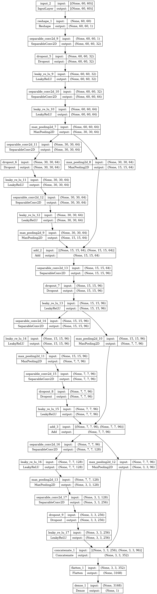

# Drowsiness Detection System

This project implements a **Drowsiness Detection System** using computer vision techniques to detect early signs of drowsiness. The system leverages **MediaPipe** for facial landmark detection and a custom-trained deep learning model to monitor eye movement and facial expressions, specifically focusing on eye closure.
Particularly useful while driving vehicles.

## Project Overview

The system tracks eye movements in real-time using a webcam or video input and triggers alerts when drowsiness is detected, helping prevent accidents caused by fatigue.

### Key Features

- **Real-time Eye Monitoring**: Tracks the user's eye movements in real-time using a webcam.
- **Facial Landmark Detection with MediaPipe**: Detects key facial landmarks, including the eye region, using the MediaPipe library.
- **Drowsiness Alert**: Issues alerts when the system detects prolonged eye closure, a sign of drowsiness.
- **Model**: A  model using CNNs and skip connections is trained to detect drowsiness based on facial features.


## Model Architecture

Below is an image of the architecture used in the trained model for drowsiness detection:



## How It Works

1. **Eye Coordinates Calculation**: 
   - The system calculates these using MediaPipe's facial landmarks, specifically focusing on the eye region.
   - It tracks the eyes in real-time to determine whether the eyes are closed for an extended period.

2. **Drowsiness Detection**:
   - If the model detects eyes closed for a set duration, the system detects drowsiness and triggers an alert (sound or visual).

## Setup Instructions

1. Clone the repository:
   ```bash
   git clone https://github.com/parth-magdum/Drowsiness_Detection.git
   cd drowsiness-detection
    ```

2. Install Requirements
    ```bash
    pip install -r requirements.txt
    ```

3. Run the main script
    ```bash
    python main.py
    ```
